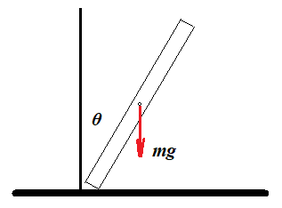

# Portfolio Summary

## Applied Machine Learning

### [Abalone Age Prediction](https://github.com/josifovskid/Abalone-Age-Prediction)

     
    Sharktopus, 2011, <i>Living abalone showing epipodium and tentacles, in display tank at Ty Warner Sea Center on Stearns Wharf, Santa Barbara, California.</i>, image, Wikimedia Commons, viewed 21 July 2020, <a href="https://commons.wikimedia.org/wiki/File:LivingAbalone.JPG">https://commons.wikimedia.org/wiki/File:LivingAbalone.JPG</a>.

Determining the age of abalone is an important task because it affects the revenue of the industry. The traditional approach is time-consuming, and different approaches are needed to speed up the process. This project aims to address that by determining the age of abalone from physical measurments with machine learning algorithms. The problem was treated as regression, and several regressors from the scikit-learn library were learned. The performance was evaluated with the $R^{2}$ score. The models however, so far are not good enough to be deployed. Namely, the best performing model is voting regression, that fits the base estimators: SVR, GaussianProcessRegressor, Ridge, RandomForestRegressor, and SGDRegressor, and has $R^{2}$ score of 0.5288, which suggests that more work is needed.

### [Exoplantes Detection](https://github.com/josifovskid/Exoplanets-Detection)

     
    ESO, 2004, <i>Composite image showing the first directly imaged exoplanet 2M1207b (the red spot on the lower left), orbiting the brown dwarf 2M1207 (centre).</i>, image, exoplanets.nasa.gov, viewed 30 August 2020, <a href="https://exoplanets.nasa.gov/resources/300/2m1207b-first-image-of-an-exoplanet/">https://exoplanets.nasa.gov/resources/300/2m1207b-first-image-of-an-exoplanet/</a>.

- Developed a solution to classifying astronomical objects detected with NASA's Kepler mission as an exoplanet, or not in Python with sklearn.
- Results: The $F_1$ score of the chosen model - Random Forest - is 0.9840.

## Scientific Computing

### [Modeling Population Dynamics](https://github.com/josifovskid/Modeling-Population-Dynamics)

     <i>Model of lynx-hare interaction.</i>

- Analyzed three different mathematical models of interactions between species: intraspecific competition, interspecific competition, and predation in MATLAB with the function pplane8.
- Modeled three study cases for each interaction:
  - spreading of SARS-CoV-2 in People's Republic of China as logistic growth,
  - competition between two species of paramecium for the same resource, and
  - predation between canadian lynx and horseshoe hare in the Hudson Bay from 1845 to 1935 in Python.

## Computational Physics 

### [Falling Stick](https://github.com/josifovskid/Falling-Stick)

     
    2017, <i>Force diagram of falling stick.</i>, image, Physics Stack Exchange, viewed 14 July 2020, Adapted from <a href="https://physics.stackexchange.com/questions/367918/how-does-the-rods-centre-of-mass-change-while-falling">https://physics.stackexchange.com/questions/367918/how-does-the-rods-centre-of-mass-change-while-falling</a>.

- Derived the Lagrangian of a falling stick.
- Numerically calculated the time the stick takes to fall down.
- Checked the numerical computation experimentally, and confirmed it.
